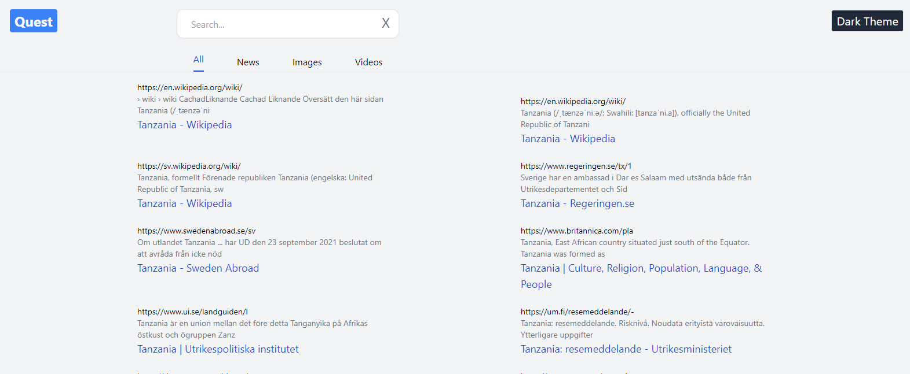
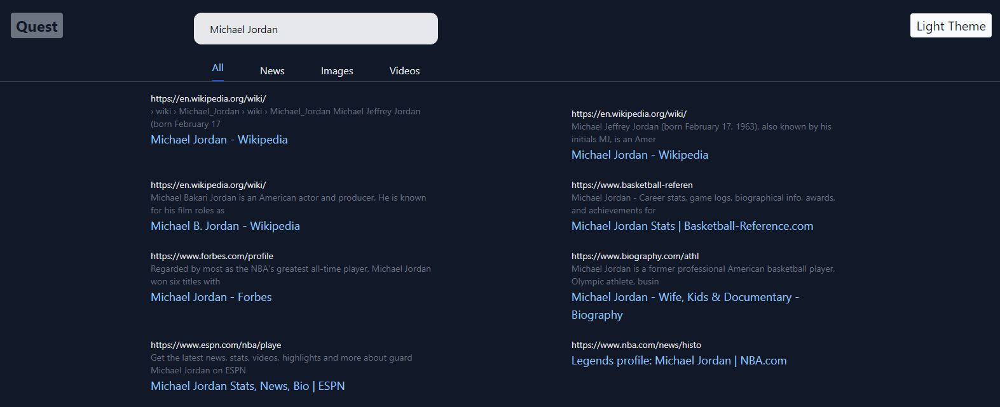

# Search App

This is an app that users Google search API to return searches of different searched terms. You can search for images, news and videos. You can toggle between a lighter theme or a darker one.

# Live Demo
<a href="https://ejokasearch.netlify.app">Live Demo</a>

## Built With

- ReactJS
- Google Search API
- TailwindCSS

## Getting Started

Open your terminal or text editor and use next command

        git clone https://github.com/emmanuelkamala/Quest-App.git

        cd Quest-App
        ### run 'npm install' to install dependencies
        ### npm start

## Opening the app

Then open the browser and enter this link:
http://localhost:3000

After if you want to do any changes please create new branch, after changes open pull request.
Happy coding! 

## Authors

👤 **Author1**

- Github: [emmanuelkamala](https://github.com/emmanuelkamala)
- Twitter: [ejkamala](https://twitter.com/ejkamala)
- Linkedin: [emmanuelkamala](https://linkedin.com/in/emmanuelkamala)

## 🤝 Contributing

Contributions, issues and feature requests are welcome!

Feel free to check the [issues page](issues/).

## Show your support

Give a ⭐️ if you like this project!.

## 📝 License

This project is [MIT](lic.url) licensed.
